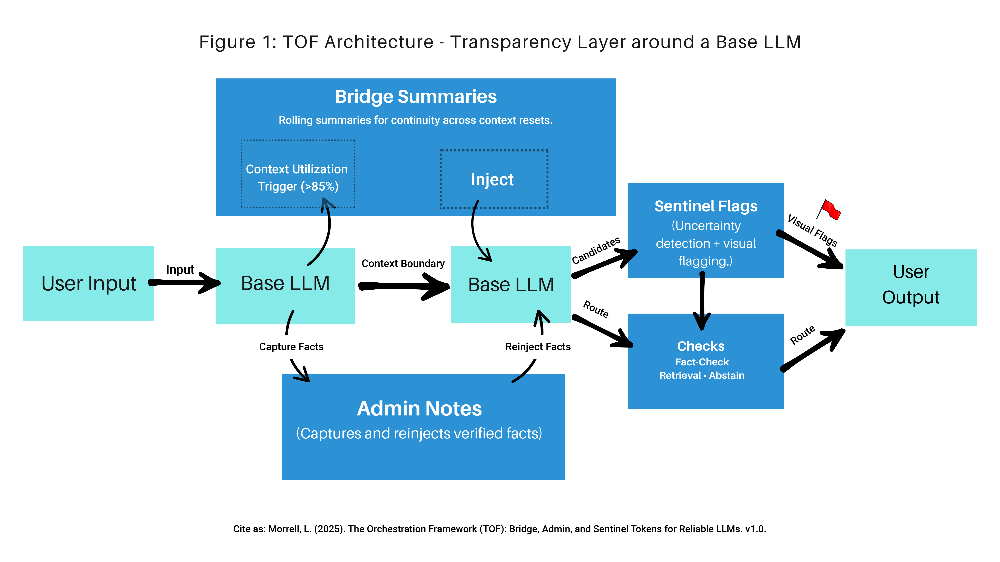
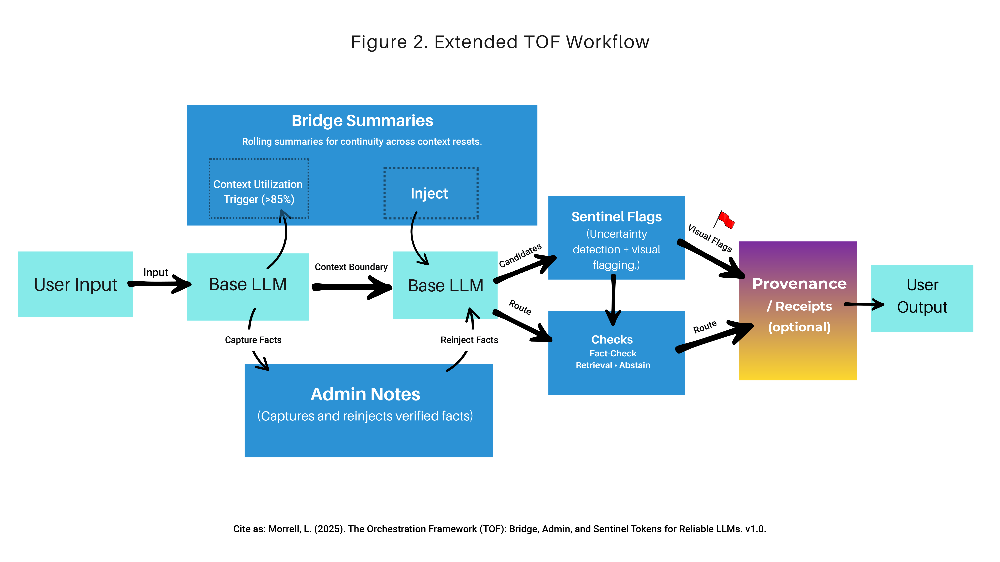

# TOF Orchestration Framework

Transparency Framework for AI Hallucination Detection
Bridge Summaries • Admin Notes • Sentinel Flags

## Overview

The **TOF Orchestration Framework** proposes a modular transparency layer for large language models (LLMs), designed to improve reliability and reduce hallucinations.
TOF focuses on three core mechanisms:

**Bridge Summaries** — carry forward rolling summaries across context windows (Context Utilization Trigger >85%).
**Admin Notes** — capture, store, and reinject validated information into the model.
**Sentinel Flags** — detect and visually flag uncertainty in generated outputs.

This repository hosts the diagrams, architecture notes, and supporting research for TOF.

## Figures

  
*Figure 1 — TOF Architecture: Transparency layer around a base LLM, showing Bridge Summaries, Admin Notes, and Sentinel Flags.*  

  
*Figure 2 — Extended TOF Workflow: Illustration of how Bridge Summaries, Admin Notes, and Sentinel Flags interact across context windows.*  

## Research Impact

AI systems are evolving faster than our ability to **trust** them.
Large language models are powerful, but they suffer from **hallucinations** — confidently generating information that may be incorrect, unverifiable, or fabricated.

The **TOF Orchestration Framework** explores a path forward by introducing mechanisms to make model reasoning transparent, traceable, and verifiable:

**Continuity Loss** → solved with **Bridge Summaries** carrying rolling context across resets.
**Fact Drift** → solved with **Admin Notes** capturing and reinjecting verified facts.
**Invisible Uncertainty** → solved with **Sentinel Flags** detecting and highlighting when the model is guessing.

TOF is **framework-agnostic** and can be applied to OpenAI, Anthropic, open-source LLMs, or future architectures.

By making uncertainty **visible**, facts **portable**, and context **persistent**, TOF supports:

Research into **hallucination detection** and model verification.
Transparent decision-making in AI-powered systems.
Policy discussions on **responsible deployment of generative AI.**

This repository makes TOF openly available for **research, reference, and citation.**

## Status & Intent

This repository contains:

Conceptual diagrams
High-level architecture proposals
Research notes

It does not include:

Source code
Benchmarks
Production-ready implementations

Researchers and developers are welcome to **reference, adapt, or extend** TOF in their own work.

## License & Citation
**Documentation & Diagrams** — CC BY 4.0
**Source Code** (if added later) — MIT License

## Preferred Citation:
Morrell, L. (2025). The Orchestration Framework (TOF): Bridge Summaries, Admin Notes, and Sentinel Flags for Reliable LLMs.

## Feedback & Collaboration

I welcome:

**Academic discussion** about the framework.
**Research collaborations** exploring transparency layers.
**Citations** in papers, articles, and open-source projects.

For inquiries or collaboration requests, contact me directly.  Lauren@PugilistOrb.com

## About the Author

**Lauren Morrell** is an **Independent Researcher** and **AI Systems Architect**, as well as the **Founder & CEO of Pugilist Orb** and **Chief Strategy Officer of SocialEyes**. 
Her work focuses on designing frameworks for **AI transparency, reliability, and ethical deployment**, exploring ways to make AI outputs **interpretable, verifiable, and accountable** 
while preserving creative potential and human agency.

🔗 https://www.linkedin.com/in/laurenmorrellfilm/ 
